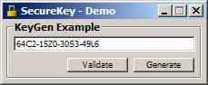



## SecureKey \- Demo

### Description

This is a demo of how to use SecureKey, a "Program Security" DLL.

Updated the Comment.
 
### More Info
 

             |
---                |---
**Submitted On**   |2003-07-30 00:23:24
**By**             |[Pioneer](https://github.com/Planet-Source-Code/PSCIndex/blob/master/ByAuthor/pioneer.md)
**Level**          |Intermediate
**User Rating**    |2.3 (14 globes from 6 users)
**Compatibility**  |VB 3\.0, VB 4\.0 \(16\-bit\), VB 4\.0 \(32\-bit\), VB 5\.0, VB 6\.0
**Category**       |[OLE/ COM/ DCOM/ Active\-X](https://github.com/Planet-Source-Code/PSCIndex/blob/master/ByCategory/ole-com-dcom-active-x__1-29.md)
**World**          |[Visual Basic](https://github.com/Planet-Source-Code/PSCIndex/blob/master/ByWorld/visual-basic.md)
**Archive File**   |[SecureKey\_1621467302003\.zip](https://github.com/Planet-Source-Code/pioneer-securekey-demo__1-47251/archive/master.zip)

